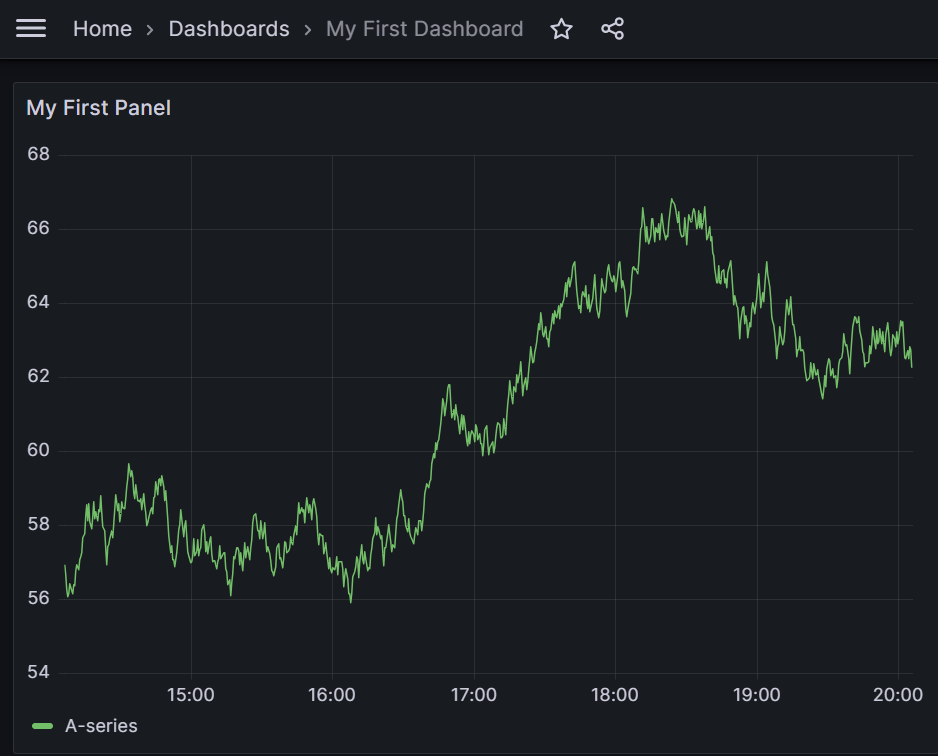

# grafana-kotlin-dsl

Create Grafana Dashboards using Kotlin DSL
```kotlin
val publisher = GrafanaPublisher("http://localhost:3000", "admin:password", GrafanaPublisher.AuthType.Basic)

publisher.publish(DashboardWithContext {
    dashboard("My First Dashboard") {
        panels {
            timeseries("My First Panel") {
                position(0, 0, 12, 12)
            }
        }
    }
})
```
And you should see a dashboard like this:




If you prefer Java, you can use the following code:
```java
public void createDashboard(){
    
    var publisher = new GrafanaPublisher("http://localhost:3000", "admin:password", GrafanaPublisher.AuthType.Basic);

    publisher.publish(new DashboardWithContext(wrapper -> {
        wrapper.dashboard("My first Dashboard", dashboard -> {
            dashboard.panels(panels -> {
                panels.timeseries("My first Panel", timeseriesPanel -> {
                    timeseriesPanel.position(0,0,12,12, gridPos -> Unit.INSTANCE);
                    return Unit.INSTANCE;
                });
                return Unit.INSTANCE;
            });
            return Unit.INSTANCE;
        });
        return Unit.INSTANCE;
    }));
}
```
# Reuse code
Let's assume you would like to make several Stat panels that only show a single purple counter. You can do like:
```kotlin
...
panels {
  stat("") {
    mixin(standalonePurpleDigit())
    //Other panel configuration
  }
//Other panels that reuses standalonePurpleDigit
}
...
```
Where the configuration of the mixin is:
```kotlin
fun standalonePurpleDigit(): StatPanel {
    return StatPanel().apply {
        fieldConfig {
            defaults {
                color {
                    mode(Color.Mode.Single)
                    fixedColor("purple")
                }
            }
        }

        options {
            textMode(StatOptions.TextMode.Value)
            colorMode(StatOptions.ColorMode.Value)
            graphMode(StatOptions.GraphMode.None)
        }
    }
}
```
If you can combine multiple mixins. If they contain same configuration, the last one will override the previous ones. If they contain different configuration, the configuration will be merged.
Lets assume you have one that configures font size of a specified value:
```kotlin
...
panels {
  stat("") {
    mixin(standalonePurpleDigit(), fontSizeTemplate(20))
    //Other panel configuration
  }
}
...
```
# Run a test instance of grafana
Go to the test-environment project and run the following the ```startup``` command on either linux or windows. Docker and python are required.
